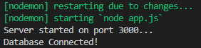

# Web Service & RESTful API for ToDoList Application

Implementation of simple To Do List application development using JavaScript with NodeJS, Web Service, RESTful API, Authentication & Authorization. The database uses MySQL which practices the Sequelize-cli migrations, models & seeders module.

## Requirement

- Javascript
- NodeJS
- ExpressJs
- Web Service
- MySQL
- API
- Postman, for building, testing, and documenting APIs

## Dependencies

```json
{
  "dependencies": {
    "bcrypt": "^5.1.0",
    "body-parser": "^1.20.2",
    "express": "^4.18.2",
    "ip": "^1.1.8",
    "jsonwebtoken": "^9.0.0",
    "morgan": "^1.10.0",
    "mysql": "^2.18.1",
    "mysql2": "^3.3.3",
    "sequelize": "^6.31.1",
    "sequelize-cli": "^6.6.0"
  }
}
```

## For Install Dependencies

```nodejs
npm install <dependencies>
```

## To Do List

This to do list feature has users who register and log in to be able to enter the To Do List. The login feature is complemented by giving tokens to users as roles, namely admin and user.

Admin roles have permission to be able to delete users, while users are not given permission. I made this permission using authentication and authorization. So the user who registers will be given permission as an admin or as a user.

## Database

Database created with sequelize-cli :

- Table todolist  
  

- Table users  
  

- Table tokenauth  
  

## Web Service & API Documentation

### Server

```git
node app.js / nodemon app
```

  


#### Todos :

Get All todos

```
GET /todos
```

Get Single todos

```
GET /todos/{id}
```

Add a new todos

```
POST /todos
```

```
Body:
{
  "title": String,
  "description": String,
  "isCompleted": Boolean
}
```

Update todos

```
PUT /todos/{id}
```

```
Body:
{
  "title": String,
  "description": String,
  "isCompleted": Boolean
}
```

Delete todos

```
DELETE todos/{id}
```

#### Auth :

Register Login

```
POST /users/register
```

```
Body:
{
  "username": String,
  "phone": String,
  "email": String,
  "password": String,
}
```

User Login

```
POST /users/login
```

```
Body:
{
  "email": String,
  "password": String
}
```
